# Claude Code Context Meter

An animated context window meter for [Claude Code](https://docs.anthropic.com/en/docs/claude-code)'s statusline, inspired by Claude Code's own thinking indicator.

<p align="center">
  
</p>

## Features

**Animated spinner** — Uses Claude Code's asterisk character set (`· ✢ ✳ ✶ ✻ ✽`) in a ping-pong cycle, matching the thinking indicator's timing (~120ms per frame).

**Shimmer sweep** — A 5-character gradient highlight continuously sweeps across the status text. Sweep speed increases with context usage:

| Zone | Context | Sweep speed | Color |
|------|---------|-------------|-------|
| Safe | < 50% | 250ms (relaxed) | Green |
| Watch | 50-59% | 200ms | Yellow |
| Warning | 60-74% | 150ms | Orange |
| Danger | 75-89% | 120ms (urgent) | Red |
| Critical | 90%+ | Full-text pulse | Red (reverse video) |

**Critical pulse** — At 90%+, the shimmer is replaced with a sinusoidal full-text pulse effect (matching Claude Code's tool-use flash), making it impossible to miss.

All animations are time-based — each render picks the current frame from the wall clock, so animations advance naturally as Claude Code refreshes the statusline.

## Requirements

- Python 3.6+ (uses f-strings)
- A terminal with truecolor support (most modern terminals)

## Install

One command:

```bash
curl -fsSL https://raw.githubusercontent.com/dnorth123/claude-code-context-meter/main/install.sh | bash
```

This downloads the script to `~/.claude/scripts/`, patches your `settings.json`, and backs up any existing statusLine config. Restart Claude Code to see the meter.

### Manual install

If you prefer to do it yourself:

1. Copy the script:

```bash
mkdir -p ~/.claude/scripts
curl -fsSL https://raw.githubusercontent.com/dnorth123/claude-code-context-meter/main/context-meter.py -o ~/.claude/scripts/context-meter.py
chmod +x ~/.claude/scripts/context-meter.py
```

2. Add to your `~/.claude/settings.json`:

```json
{
  "statusLine": {
    "type": "command",
    "command": "$HOME/.claude/scripts/context-meter.py",
    "padding": 0
  }
}
```

3. Restart Claude Code. The meter appears once context usage is above 0%.

## Customization

### Colors

Edit the `ZONES` list in the script. Each entry is `(min_percentage, base_rgb, shimmer_rgb, sweep_ms)`:

```python
ZONES = [
    (90, (255,  55,  55), (255, 200, 200),  80),   # critical
    (75, (255,  55,  55), (255, 180, 180), 120),   # danger
    (60, (255, 140,   0), (255, 220, 130), 150),   # warning
    (50, (255, 214,   0), (255, 255, 160), 200),   # watch
    ( 0, ( 46, 204,  64), (170, 255, 180), 250),   # safe
]
```

### Spinner characters

The `SPIN` array contains the ping-pong sequence. Claude Code uses different sets per platform:

| Platform | Characters |
|----------|-----------|
| macOS | `· ✢ ✳ ✶ ✻ ✽` |
| Ghostty | `· ✢ ✳ ✶ ✻ *` |
| Linux/Windows | `· ✢ * ✶ ✻ ✽` |

The default is the macOS set. Edit `SPIN` to match your platform or preference.

## Optional: Context Threshold Hooks

Automated circuit breakers that warn you as the context window fills up, prompting you to save state and start a fresh session before quality degrades.

### Install with hooks

```bash
curl -fsSL https://raw.githubusercontent.com/dnorth123/claude-code-context-meter/main/install.sh | bash -s -- --with-hooks
```

This installs the meter plus:
- **Stop hook** — fires after each Claude turn, checks context percentage
- **SessionStart hook** — loads the most recent saved session state on startup
- **`/save-state` command** — saves a structured session summary (skipped if you already have one)

### Thresholds

| Level | Trigger | Behavior |
|-------|---------|----------|
| Checkpoint | 60% | Brief status report — what's done, what remains, whether to save now |
| Interrupt | 75% | Recommends running `/save-state` and `/clear` |
| Urgent | 90% | Tells you to `/save-state` and `/clear` immediately |

Each threshold fires once per session. After warning, it won't repeat at the same level.

### The save-state flow

1. Context hits a threshold → hook warns you
2. Run `/save-state` → creates a structured summary in `~/.claude/session-states/`
3. Run `/clear` → starts a fresh session
4. The session-start hook automatically loads your saved state

State files are kept (up to 10, oldest pruned automatically) so you can reference prior sessions.

### Remove hooks

```bash
curl -fsSL https://raw.githubusercontent.com/dnorth123/claude-code-context-meter/main/install.sh | bash -s -- --remove-hooks
```

This removes the hooks and bridge files but leaves the context meter intact.

## How it works

Claude Code calls the statusline command on each render cycle, passing JSON on stdin with context window data. The script:

1. Parses `used_percentage` and token counts from stdin
2. Selects the color zone based on percentage thresholds
3. Computes the current spinner frame from `time.time()` (wall clock / 120ms)
4. Computes the shimmer position from `time.time()` (wall clock / sweep speed)
5. Renders each character with the appropriate ANSI truecolor escape code
6. Prints the result — Claude Code displays it in the statusline

No state is persisted between calls. Each invocation is stateless and deterministic for a given timestamp.

## License

MIT
